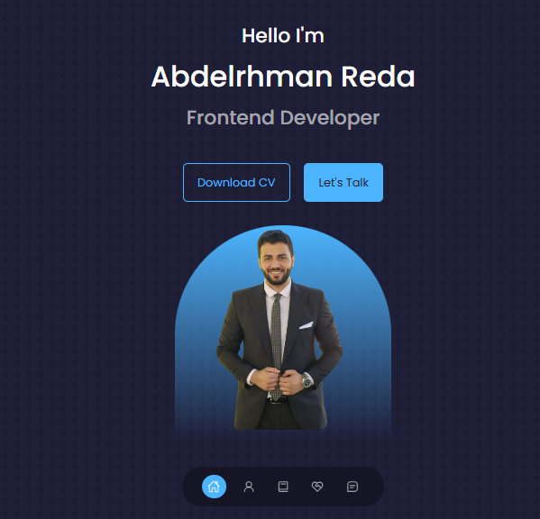

# 🌐 My Portfolio Website

This is my personal **portfolio website** built with **React** and **Vite**.  
It showcases my skills, projects, and contact information in a clean, modern UI.

---

## 🚀 About the Project

While building this project, I learned how to:

- Organize project files and folders effectively.
- Build **reusable React components**.
- Use **React Icons**, **EmailJS**, and **Tailwind / CSS Modules** for styling.
- Create **smooth animations** and transitions.
- Deploy a React + Vite app to **Netlify**.

---

## 🧠 Tech Stack

- ⚛️ **React** (Vite)
- 🎨 **Pure CSS**
- 💌 **EmailJS** (for contact form)
- 🌍 **Netlify** (for deployment)

---

## 📸 Preview

---

## 🧩 Project Structure
